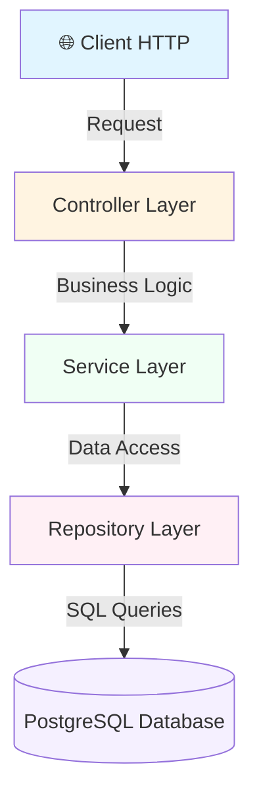

<div align="center">

# 🧵 Tricol - Gestion des Fournisseurs


</div>

---

## 📋 Description


Application web Java développée avec **Spring Core** (sans Spring Boot) pour gérer les fournisseurs de l'entreprise Tricol. L'application expose une API REST complète pour effectuer des opérations CRUD sur les fournisseurs.

## 🛠️ Technologies Utilisées

<table>
<tr>
<td align="center" width="96">

<br>Java 11
</td>
<td align="center" width="96">

<br>Spring 5.3.30
</td>
<td align="center" width="96">

<br>PostgreSQL
</td>
<td align="center" width="96">

<br>Hibernate 5.6
</td>
<td align="center" width="96">

<br>Tomcat 9.0
</td>
<td align="center" width="96">

<br>Maven
</td>
</tr>
</table>

## 🏗️ Architecture

<div align="center">



</div>


### 📁 Structure du Projet

```
src/main/java/com/salma/
├── 🔧 config/                       # Configuration Spring
│   ├── AppConfig.java              # Configuration principale
│   ├── JpaConfig.java              # Configuration JPA/Hibernate
│   ├── WebConfig.java              # Configuration Spring MVC
│   └── WebAppInitializer.java     # Initialisation (remplace web.xml)
├── 🎮 controller/                   # Contrôleurs REST
│   ├── FournisseurController.java
│   └── HomeController.java
├── 📦 model/                        # Entités JPA
│   └── Fournisseur.java
├── 🗄️ repository/                   # Repositories Spring Data JPA
│   └── FournisseurRepository.java
└── ⚙️ service/                      # Services métier
    ├── FournisseurService.java
    └── impl/
        └── FournisseurServiceImpl.java
```

## 📦 Prérequis

<div align="center">

| Outil | Version | Badge |
|-------|---------|-------|
| Java JDK | 11+ |  |
| Maven | 3.6+ |  |
| PostgreSQL | 12+ |  |
| Tomcat | 9.0.111 |  |
| IntelliJ IDEA | Recommandé |  |

</div>

## 🚀 Installation et Configuration

### 1️⃣ Cloner le projet

```bash
git clone https://github.com/saalmahm/tricol-fournisseurs-management
cd tricol-fournisseurs-management
```

### 2️⃣ Configurer PostgreSQL

Créez la base de données :

```sql
CREATE DATABASE tricol_fournisseurs;
```

<div align="center">

</div>

### 3️⃣ Configurer application.properties

Modifiez `src/main/resources/application.properties` :

```properties
# Configuration PostgreSQL
db.driver=org.postgresql.Driver
db.url=jdbc:postgresql://localhost:5432/tricol_fournisseurs
db.username=votre_username
db.password=votre_password

# Hibernate Configuration
hibernate.dialect=org.hibernate.dialect.PostgreSQLDialect
hibernate.show_sql=true
hibernate.format_sql=true
hibernate.hbm2ddl.auto=update
```

### 4️⃣ Compiler le projet

```bash
mvn clean package
```

<div align="center">

</div>

### 5️⃣ Déployer sur Tomcat

#### 🖥️ Option A : Via IntelliJ IDEA

1. File → Settings → Application Servers → + → Tomcat Server
2. Configurer le chemin Tomcat : `C:\apache-tomcat-9.0.111`
3. Run → Edit Configurations → + → Tomcat Server → Local
4. Deployment → + → Artifact → `tricol-fournisseurs-management:war exploded`
5. Application context : `/tricol`
6. Cliquer sur Run ▶️

#### 🔧 Option B : Déploiement manuel

```bash
cp target/tricol-fournisseurs-management-1.0-SNAPSHOT.war $TOMCAT_HOME/webapps/tricol.war
$TOMCAT_HOME/bin/startup.sh
```

## 🌐 Endpoints API

### 💚 Health Check

```
GET http://localhost:8080/tricol/
```

<div align="center">

**Réponse :**

```json
{
  "status": "UP",
  "message": "✅ Application Tricol fonctionne !",
  "application": "Gestion des Fournisseurs",
  "version": "1.0-SNAPSHOT"
}
```


</div>

### 📋 Fournisseurs

<div align="center">

| Méthode | Endpoint | Description | Status |
|---------|----------|-------------|--------|
|  | `/api/v1/fournisseurs` | Liste tous les fournisseurs | ✅ |
|  | `/api/v1/fournisseurs/{id}` | Récupère un fournisseur par ID | ✅ |
|  | `/api/v1/fournisseurs` | Crée un nouveau fournisseur | ✅ |
|  | `/api/v1/fournisseurs/{id}` | Modifie un fournisseur | ✅ |
|  | `/api/v1/fournisseurs/{id}` | Supprime un fournisseur | ✅ |
|  | `/api/v1/fournisseurs/search?keyword=...` | Recherche par société | ✅ |
|  | `/api/v1/fournisseurs/ville/{ville}` | Filtre par ville | ✅ |

</div>

### 📝 Exemples de Requêtes

#### ➕ Créer un fournisseur (POST)

```bash
curl -X POST http://localhost:8080/tricol/api/v1/fournisseurs \
  -H "Content-Type: application/json" \
  -d '{
    "societe": "Tissus du Maroc SARL",
    "adresse": "Zone Industrielle Ain Sebaa",
    "contact": "Ahmed Bennani",
    "email": "contact@tissusmaroc.ma",
    "telephone": "0522-123456",
    "ville": "Casablanca",
    "ice": "001234567890123"
  }'
```

#### 📋 Récupérer tous les fournisseurs (GET)

```bash
curl http://localhost:8080/tricol/api/v1/fournisseurs
```

## 📊 Modèle de Données

### 🏢 Entité Fournisseur

<div align="center">

| Champ | Type | Contraintes | Icon |
|-------|------|-------------|------|
| id | Long | 🔑 Clé primaire, auto-incrémenté | 🆔 |
| societe | String | ✅ Obligatoire, 2-100 caractères | 🏢 |
| adresse | String | ✅ Obligatoire, max 255 caractères | 📍 |
| contact | String | ✅ Obligatoire, 2-100 caractères | 👤 |
| email | String | ✅ Obligatoire, unique, format email | 📧 |
| telephone | String | ✅ Obligatoire, 10-20 caractères | 📞 |
| ville | String | ✅ Obligatoire, 2-50 caractères | 🌆 |
| ice | String | ✅ Obligatoire, unique, 15 caractères | 🔢 |

</div>

## 🧪 Tests

### 🔵 Avec Postman

<div align="center">

</div>

1. Téléchargez Postman
2. Importez la collection (si disponible)
3. Testez les endpoints

### 🟢 Avec cURL

Voir les exemples dans la section Endpoints API

## 📝 Concepts Spring Utilisés

<div align="center">

| Concept | Description | Badge |
|---------|-------------|-------|
| IoC | Inversion of Control |  |
| DI | Dependency Injection |  |
| JPA | Spring Data JPA |  |
| Transaction | @Transactional |  |
| Validation | Bean Validation |  |
| REST | @RestController |  |

</div>

---

## 👨‍💻 Auteur

**Saalma hm** - [GitHub](https://github.com/saalmahm)

---

⭐ N'oubliez pas de donner une étoile si ce projet vous a été utile !